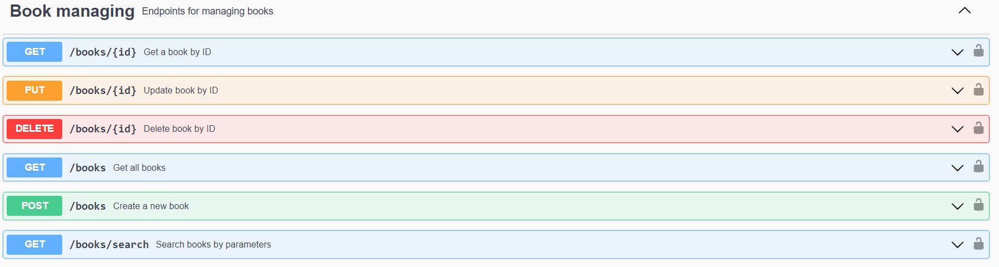
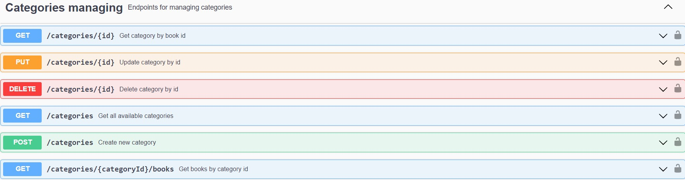
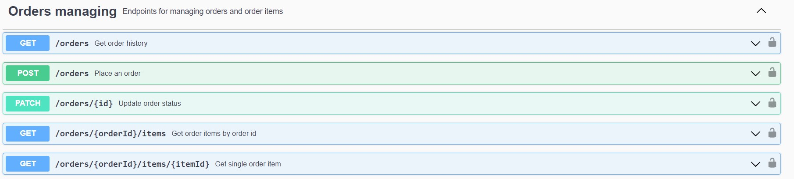
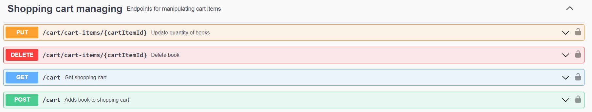
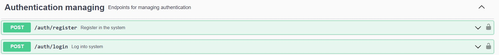
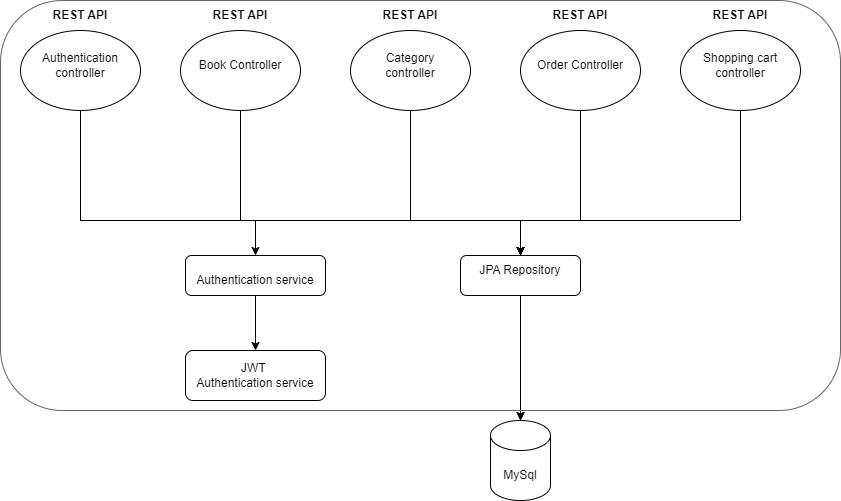
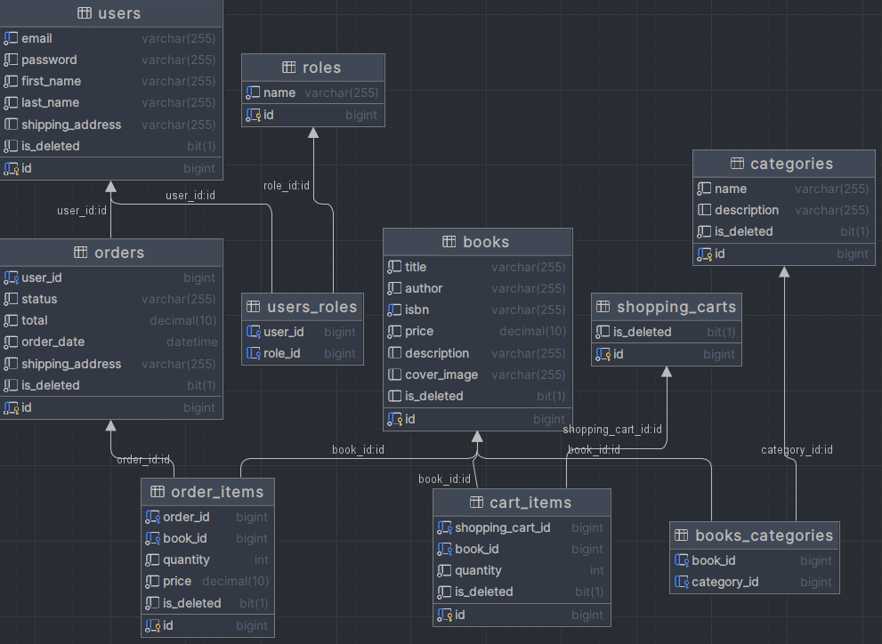

# Book Store 📚

## 💡Short overview of the project:  

#### The main problems this project solves are as follows: 

* #### It's a secure application where in order to get access to any endpoints - registration required. 🔒🛡️

* #### There all necessary entities for full cycle of product purchasing: User, Role, Book, Category, Shopping Cart, Cart Item, Order and Order Item. 🛒📚🛍️ 

* #### N + 1 problems excluded, that's why retrieval of any information from database will be fast and optimized. ⚡🚀

* #### Application will be executed on any computer with any OS - Docker included in this project. 🖥️🐳

# 💥 General functionality of the project:

## 📓 _Book Controller_

* #### **Admin** is able to post new books, edit or delete them
* #### **User** can browse through all books, search by parameters or look for a specific book
#
## 📜 _Category Controller_

* #### **Admin** is capable of creating new categories, updating existing ones or deleting them
* #### **User** can check all categories available, look at certain category or get a list of books of a chosen category
#
## 📦 _Order Controller_

* #### **Admin** can update a status of order
* #### **User** have the ability to place an order, check order history and look at specific orders
#
## 🛒 _Shopping Cart Controller_

* #### **User** is able to add book to shopping cart, retrieve all the books being placed there, delete book or update its quantity
#
## 🔐 _Authentication Controller_

* #### In order to gain access to whole functionality, newcomer needs to register and login
* #### There are two roles here: **Admin**👨🏻‍💼 and **User**🧑🏻‍💻

#
### 👨‍💻 Technologies used:

  
♨️ Java

`17 version of Java is used`

    
🍃️ Spring Boot

`3.1.4 version of Spring Boot`

    
🐳 Docker

`Allows to run this application on every OS`

    
🐬 MySql

`Relational database for managing your data`

    
📖 Swagger

`Provides a comfortable documentation and testing environment for this API`

    
🛠️ Lombok

`1.18.22 version of lombok library is used here`

  
🧪 + 🚰 Liquibase

`3.10.3 version of liquibase is used here`

    
🗺️ + 🏗️ Mapstruct

`1.5.3 version of mapstruct library is used here`

    
🔒 + 🌱 Spring Security

`3.1.4 version is used here`

    
🛢️ + 🌱 Spring Data JPA

`3.1.4 version is used here`

# 🗂️ Project structure: 

# 🛢️ Database structure:

#

# How to launch this application? 🚀

### Few steps and we are done: 
* We are going to use Docker, so make sure its downloaded on your machine
* You will need an **.env** file, where you should put all the required environment variables
* In terminal, type mvn clean package && docker-compose build && docker-compose up
* The app will be running locally at http://localhost:8081/api
* But it's more comfortable to test it on Swagger, here is a link: http://localhost:8081/api/swagger-ui/index.html#/
    