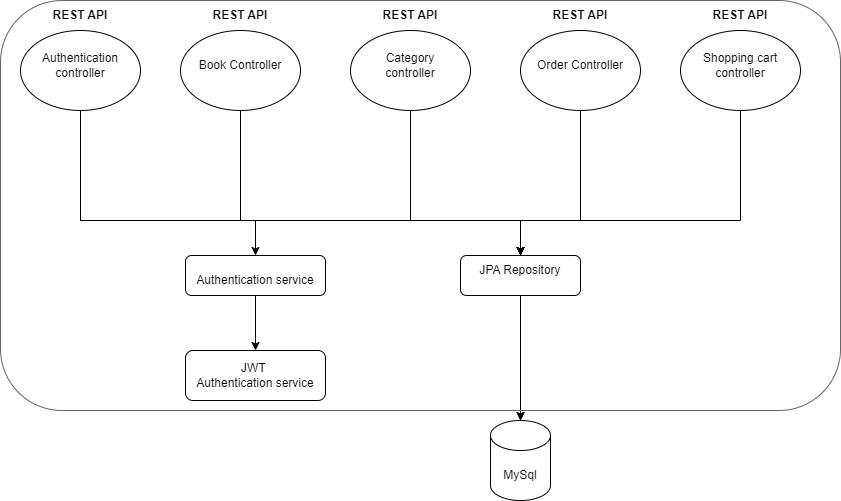
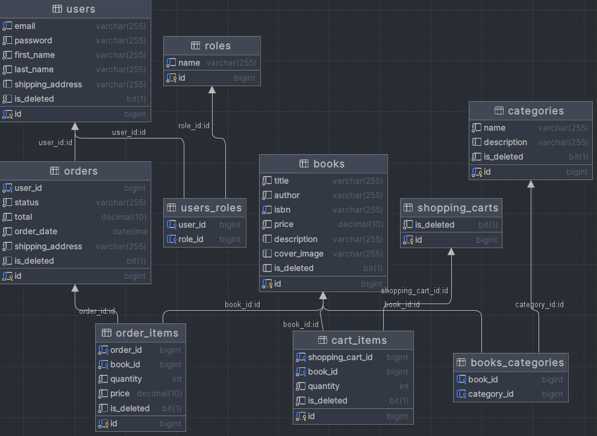

# Book Store 📚

* #### Do you want to transport your local bookstore to the World Wide Web? 🌐

* #### Tired of putting so many efforts into your store, but not getting expected revenue? 💸

* #### Striving to start a new chapter in your life? 📆

## If this concerns you, then you are in the right place!✨

# 🗂️ Project structure: 

# 🛢️ Database structure:

# 💥 General functionality of the project:

## 📓 _Book Controller_

* #### **Admin** is able to post new books, edit or delete them
* #### **User** can browse through all books, search by parameters or look for a specific book
#
## 📜 _Category Controller_
* #### **Admin** is capable of creating new categories, updating existing ones or deleting them
* #### **User** can check all categories available, look at certain category or get a list of books of a chosen category
#
## 📦 _Order Controller_
* #### **Admin** can update a status of order
* #### **User** have the ability to place an order, check order history and look at specific orders
#
## 🛒 _Shopping Cart Controller_
* #### **User** is able to add book to shopping cart, retrieve all the books being placed there, delete book or update its quantity
#
## 🔐 _Authentication Controller_
* #### In order to gain access to whole functionality, newcomer needs to register and login
* #### There are two roles here: **Admin**👨🏻‍💼 and **User**🧑🏻‍💻
#
### 👨‍💻 Technologies used:

  
♨️ Java

  `Java is the main language being used in this project`

    
🍃️ Spring Boot

`Framework for creating java-based applications`

    
🐳 Docker

`Makes your program run on every OS`

    
🐬 MySql

`Relational database for managing your data`

    
📖 Swagger

`Provides a comfortable documentation and testing environment for your API`

    
🛠️ Lombok

`Library that offers you reducing boilerplate code`

  
🧪 + 🚰 Liquibase

`Allows to migrate database changes more securely`

    
🗺️ + 🏗️ Mapstruct

`Helps to change a state of object to different dto`

    
🔒 + 🌱 Spring Security

`Gives your app good instruments for authentication and authoriztion process`

    
🛢️ + 🌱 Spring Data JPA

`Makes data manipulation simpler, allows to focus on custom queries`

# How to launch this application? 🚀

### Few steps and we are done: 
* We are going to use Docker, so make sure its downloaded on your machine
* You will need an **.env** file, where you should put all the required environment variables
* In terminal, type mvn clean package && docker-compose build && docker-compose up
* The app will be running locally at http://localhost:8081
* But it's more comfortable to test it on Swagger, here is a link: http://localhost:8081/swagger-ui/index.html#/
    